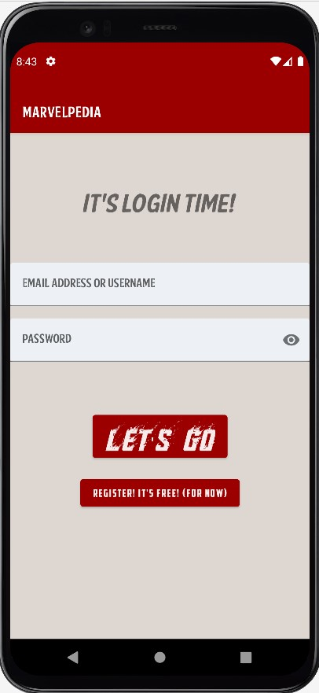
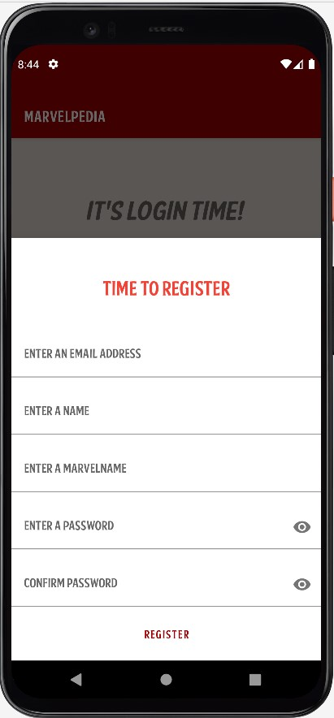
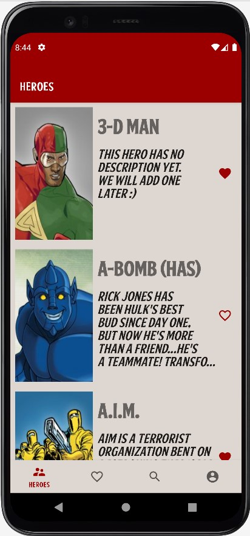
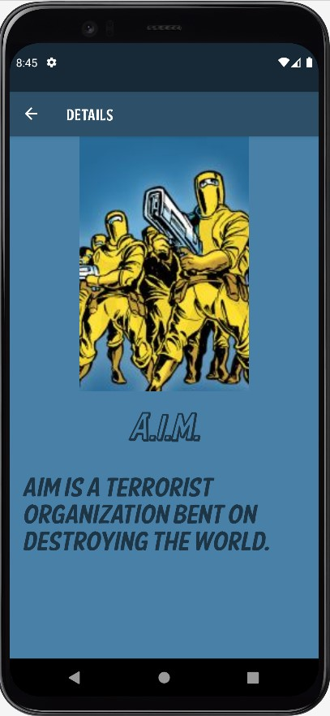
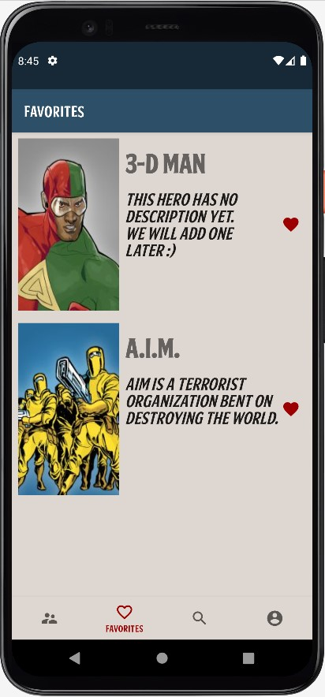
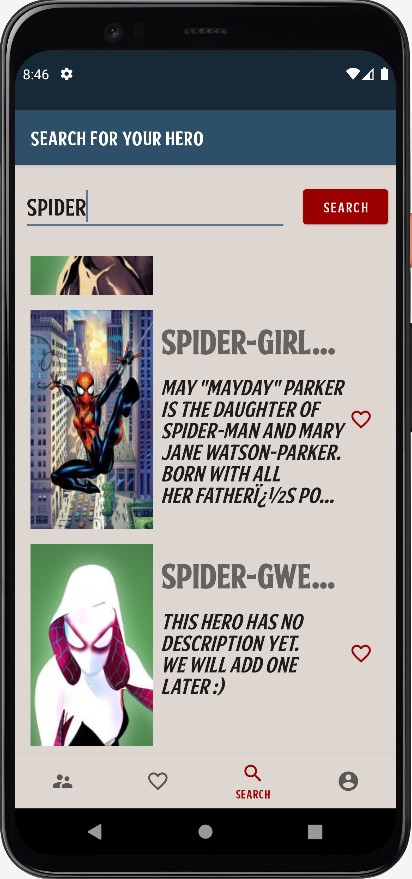
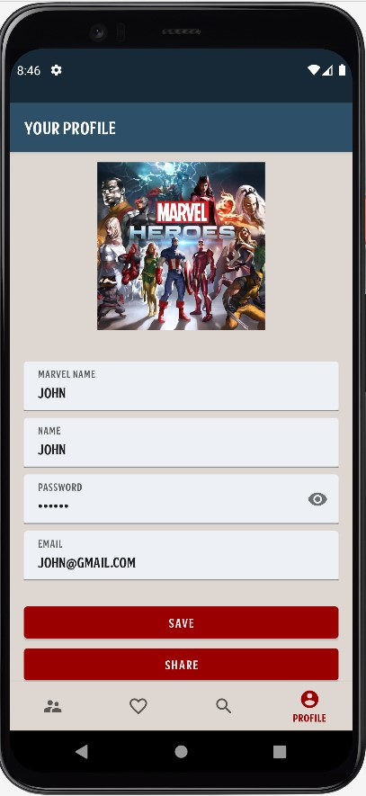

# Marvelpedia

This project is developed for [Project Future 2021 - Mobile Apps Development powered by Code.Hub](https://www.projectfuture.gr/mobile-apps-development)

The app will allow the users to:

 - Login with their credentials. 
 - See the whole list of the Marvel
    Heroes.
 - Mark their favorite ones and have them organised in a
    different screen. 
 - When they click on one Marvel Hero, a screen with
    more details about them will open.
- Search for any Marvel Hero.
- Edit/Change their profile page.
- And last but not least, the app will function in offline mode too, if the users do not currently have a network connection!

#### *And some more cool features to come!!..*

The project is written 100% in Java and follows the MVVM architecture.
It uses:
- ViewModels
- LiveData
- Navigation component
- Room
- Volley
- GSON
- and Glide.

### *Some screenshots:*

 

 
  
